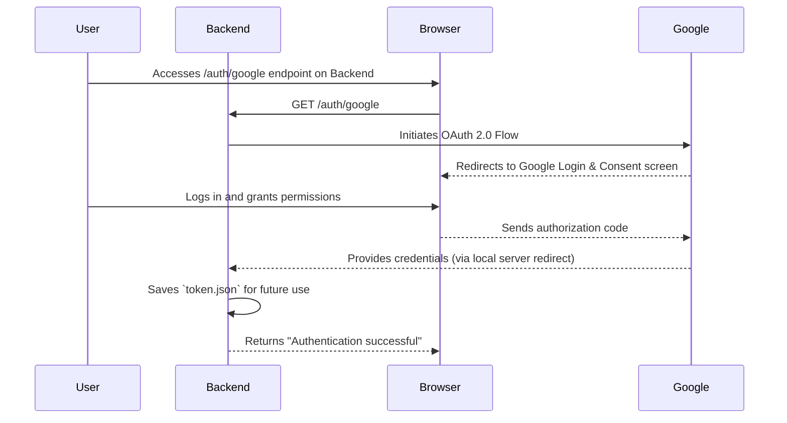

# Architecture & Design

This document outlines the architecture, technologies, and design patterns used in the Appointment Scheduler application.

## 1. Technology Stack

- **Backend:**
  - **Framework:** FastAPI (Python 3)
  - **Data Validation:** Pydantic
  - **Server:** Uvicorn (ASGI server)
  - **Calendar Integration:** Google API Client Library for Python (`google-api-python-client`, `google-auth-oauthlib`)

- **Frontend:**
  - **Library:** React.js
  - **Build Tool:** Vite
  - **UI Components:** Ant Design (`antd`)
  - **Date/Time Handling:** Day.js

## 2. Architecture Overview

The application follows a **client-server architecture**, with a clear separation between the frontend (client) and the backend (server).

- **Backend (Server):** A RESTful API built with FastAPI. It is responsible for all business logic, including:
  - Storing and managing availability configurations.
  - Calculating available appointment slots.
  - Interacting with the external Google Calendar API.
  - Handling user authentication with Google.

- **Frontend (Client):** A Single-Page Application (SPA) built with React. It is responsible for the user interface and user experience:
  - Provides a configuration panel for the calendar owner.
  - Provides a booking interface for clients.
  - Communicates with the backend via HTTP requests to fetch data and trigger actions.

## 3. Design Patterns & Concepts

- **Dependency Injection (FastAPI):** FastAPI's dependency injection system is used to manage the Google Calendar service instance (`get_calendar_service`). This makes the API endpoints more modular and easier to test, as the calendar service is provided as a dependency rather than being hard-coded.
- **In-memory Database (for now):** The availability configuration is stored in a simple in-memory Python dictionary. This is a simplification for the current version. In a production environment, this would be replaced by a persistent database (e.g., PostgreSQL, MongoDB, or a simple file-based DB like SQLite).
- **Component-Based UI (React):** The frontend is built using a component-based architecture. The UI is broken down into reusable components like `ConfigurationView` and `BookingView`.

## 4. System Diagrams

### Component & Flow Diagram

This diagram shows the main components of the system and the flow of information between them.

### Authentication Flow

This diagram illustrates the one-time authentication process.

